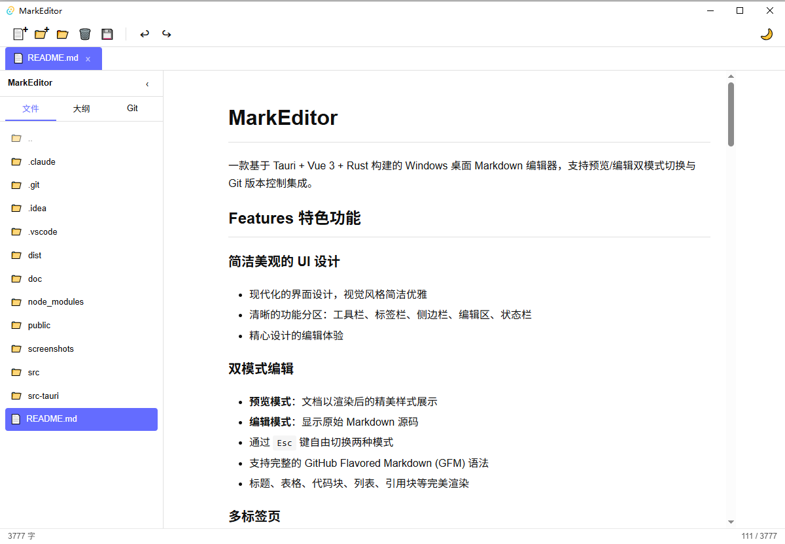
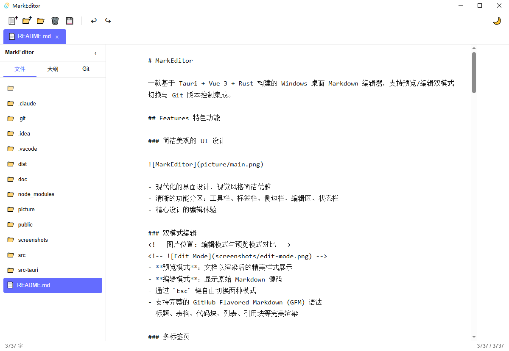
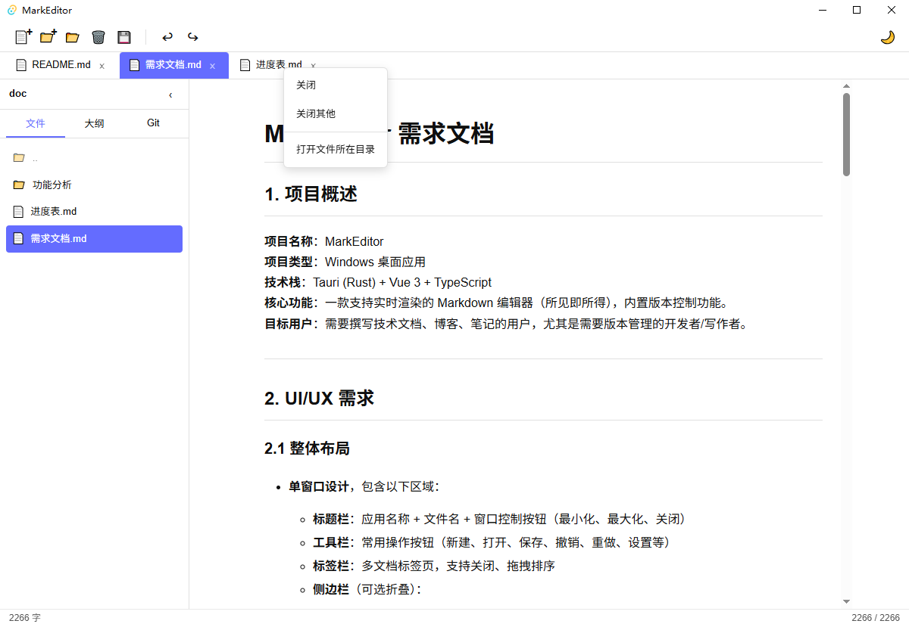
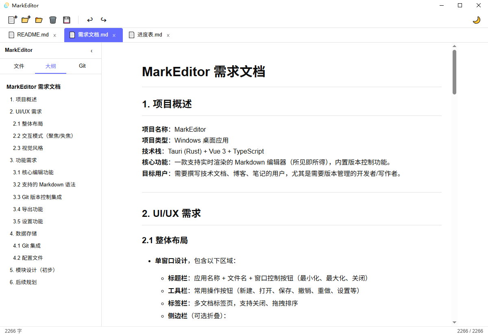
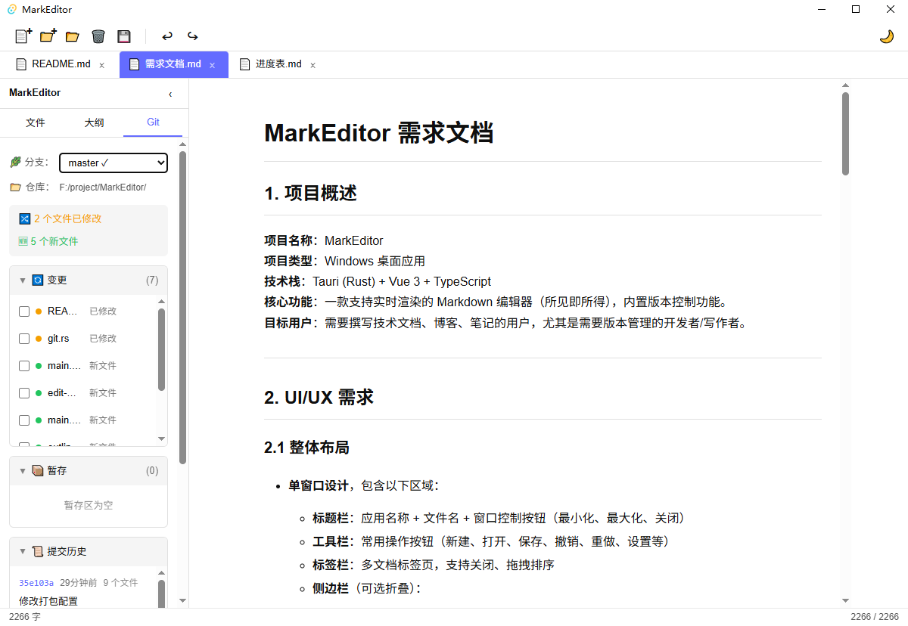
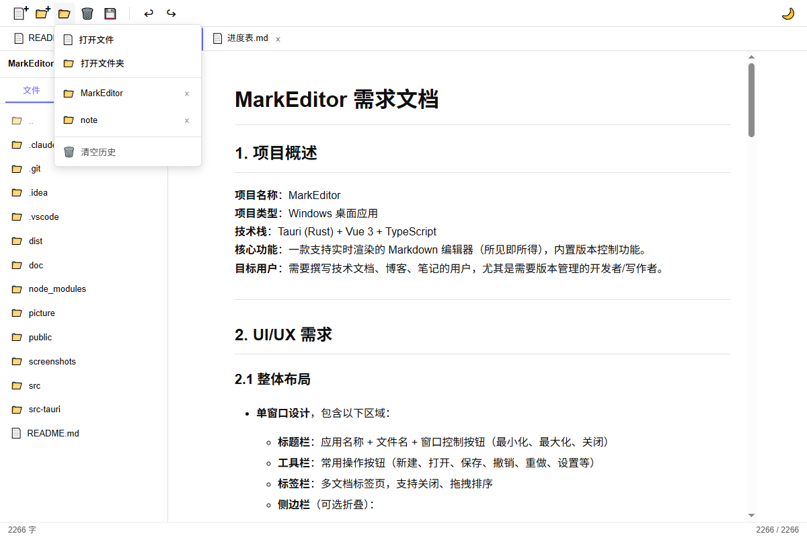
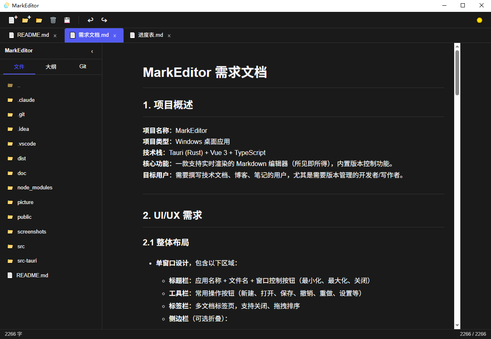

# MarkEditor

一款基于 Tauri + Vue 3 + Rust 构建的 Windows 桌面 Markdown 编辑器，支持预览/编辑双模式切换与 Git 版本控制集成。

## Features 特色功能

### 简洁美观的 UI 设计



- 现代化的界面设计，视觉风格简洁优雅
- 清晰的功能分区：工具栏、标签栏、侧边栏、编辑区、状态栏
- 精心设计的编辑体验

### 双模式编辑
 
- **预览模式**：文档以渲染后的精美样式展示
- **编辑模式**：显示原始 Markdown 源码
- 通过 `Esc` 键自由切换两种模式
- 支持完整的 GitHub Flavored Markdown (GFM) 语法
- 标题、表格、代码块、列表、引用块等完美渲染

### 多标签页

- 支持多文档同时编辑
- 标签页支持关闭、切换
- 文件修改状态实时显示

### 文件目录

- 侧边栏文件树展示项目结构
- 支持打开文件夹作为工作目录
- 文件/文件夹的创建、重命名、删除操作
- 自动刷新文件列表

### 大纲视图




- 根据文档标题（h1~h6）层级展示文档结构
- 点击标题可快速跳转定位
- 实时更新，跟随文档内容变化

### Git 版本控制集成

- **内置 Git 操作**：无需离开编辑器即可完成版本控制
  - 仓库初始化
  - 文件暂存/取消暂存/全部暂存
  - 提交管理
  - 提交历史查看
  - 文件 Diff 对比（工作区与历史版本）
  - 分支查看与切换
- 自动检测 Git 用户信息（支持全局/局部 git config）
- 侧边栏实时显示变更文件与状态

### 最近打开文件


- 记录最近打开的文件和文件夹
- 快速访问历史记录
- 最多保存 10 条记录

### 主题切换

- 浅色/深色主题自由切换
- 简洁的深色模式，适合夜间写作

## Tech Stack 技术架构

```
┌─────────────────────────────────────────────────────┐
│                    Vue 3 + TypeScript               │
│                  (渲染层 / UI 组件)                  │
├─────────────────────────────────────────────────────┤
│                      Tauri 2                        │
│                    (窗口管理 / IPC)                  │
├─────────────────────────────────────────────────────┤
│                     Rust                            │
│        (文件操作 / Git 操作 / 系统交互)              │
└─────────────────────────────────────────────────────┘
```

| 层级 | 技术 | 说明 |
|------|------|------|
| 前端框架 | Vue 3 + TypeScript | 组合式 API (Composition API) |
| 构建工具 | Vite | 快速开发与构建 |
| 状态管理 | Pinia | 轻量级状态管理 |
| Markdown | marked | Markdown 解析与渲染 |
| 桌面框架 | Tauri 2 | Rust 后端 + WebView2 渲染 |
| Git 操作 | git2 | Rust Git 库 |
| 文件系统 | walkdir | 目录遍历 |

## Build 构建

### 环境要求

- **Node.js** >= 18
- **Rust** >= 1.70
- **Git** (用于构建依赖)
- **Visual Studio Build Tools** (Windows)

### 安装依赖

```bash
# 安装前端依赖
npm install

# 安装 Rust 依赖 (自动通过 cargo)
cargo fetch
```

### 开发模式

```bash
# 启动 Vite 开发服务器 + Tauri 窗口
npm run tauri dev
```

### 生产构建

```bash
# 构建前端 + 打包 Tauri 应用
npm run tauri build
```

构建产物位于 `src-tauri/target/release/bundle/msi/` 目录下。

## Project Structure 项目结构

```
MarkEditor/
├── src/                         # Vue 前端源码
│   ├── components/              # UI 组件
│   │   ├── sidebar/              # 侧边栏组件
│   │   │   ├── Sidebar.vue       # 侧边栏容器
│   │   │   ├── OutlineTab.vue    # 大纲视图
│   │   │   └── GitTab.vue        # Git 面板
│   │   └── editor/               # 编辑器组件
│   ├── stores/                   # Pinia 状态管理
│   │   └── git.ts                # Git 状态
│   ├── App.vue                   # 主应用组件
│   └── main.ts                   # 前端入口
├── src-tauri/                    # Rust 后端源码
│   ├── src/
│   │   ├── commands/             # Tauri 命令
│   │   │   ├── file.rs           # 文件操作
│   │   │   └── git.rs            # Git 操作
│   │   ├── lib.rs                # 库入口
│   │   └── main.rs              # 主入口
│   ├── Cargo.toml               # Rust 依赖配置
│   └── tauri.conf.json          # Tauri 配置
├── doc/                          # 项目文档
├── package.json                  # Node 依赖配置
└── README.md                     # 项目说明
```

## Shortcuts 快捷键

| 快捷键 | 功能 |
|--------|------|
| `Ctrl + S` | 保存文件 |
| `Ctrl + Z` | 撤销 |
| `Ctrl + Y` | 重做 |
| `Esc` | 切换预览/编辑模式 |

## License 许可证

MIT License
